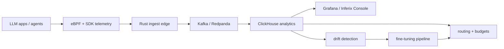

<div align="center">


# Akshant Sharma

### Staff Engineer building distributed systems, high-cardinality data planes, and open-source AI infrastructure.

[](#)
[](#)
[](#)
[](#)
[](#)
[](#)
[](https://github.com/AkshantVats)

I work on the infrastructure layer underneath product features: ingestion engines, storage primitives, streaming pipelines, observability systems, and reliability controls that survive real traffic.

Currently building **Inferix**, a self-hosted AI infrastructure platform that connects inference observability, agent tracing, routing, drift detection, and retraining loops.

[LinkedIn](https://linkedin.com/in/akshantsharma07) · [Blog](https://akshantvats.github.io/Profile/blog/) · [Profile Site](https://akshantvats.github.io/Profile/) · [Email](mailto:akshant3@gmail.com)

<br/>

[`inferix`](#what-i-am-building-now) · [`flagship oss`](#flagship-oss) · [`scale`](#production-scale-i-have-worked-on) · [`stack`](#stack) · [`contact`](mailto:akshant3@gmail.com)

</div>

---

## What I Am Building Now

### Inferix: the AI infrastructure control plane

Teams shipping LLM features quickly run into the same production problems: high-cardinality inference events, hidden token spend, missing agent traces, routing regressions, quality drift, and retraining workflows that do not connect to production feedback.

Inferix is the platform I am building to close that loop: observe every inference call, trace agent execution, route by quality and cost, detect drift, and feed production signals back into fine-tuning.



| Layer | Component | What it proves |
|---|---|---|
| Inference observability | [LensAI / infra-ai-streaming](https://github.com/AkshantVats/infra-ai-streaming) | Rust ingest, WAL durability, Kafka, Go consumer, ClickHouse, Grafana, chaos tests |
| Zero-SDK telemetry | [ebpf-llm-tracer](https://github.com/AkshantVats/ebpf-llm-tracer) | Kernel-level LLM HTTP tracing without app code changes |
| Agent execution | TraceForge | Tool-call spans, replay, benchmark runner, agent workflow visibility |
| Routing + cost control | RouteIQ | Semantic cache, prompt fingerprints, tenant budgets, fallback chains |
| Quality loop | DriftWatch + FineForge | Drift detection, judge evals, data prep, LoRA training, model registry |

The private 150-day plan is the execution root behind this platform: daily code artifacts, design docs, benchmarks, launch notes, and learning threads that turn the product thesis into repos.

---

## Flagship OSS

### [infra-ai-streaming](https://github.com/AkshantVats/infra-ai-streaming)

**Sub-100ms AI inference observability at 1M events/min: Kafka-backed, ClickHouse-native, multi-tenant.**

```text
Rust ingestion edge -> Kafka / Redpanda -> Go batch consumer -> ClickHouse -> Grafana
```

Built with:

- Rust/Axum HTTP ingest with WAL durability and per-tenant rate limits
- Kafka transport with channel-based backpressure
- Go consumer with ClickHouse batching, Redis overflow, circuit breaker, and DLQ
- Z-score latency anomaly detection per tenant and model
- Helm, k3d E2E, Grafana dashboards, Prometheus metrics, and chaos scenarios

The goal is not a toy demo. It is the kind of repo I would want to review in a serious infrastructure interview: architecture docs, tradeoffs, runbooks, benchmarks, failure modes, and deploy paths.

<div align="center">

[](https://github.com/AkshantVats/infra-ai-streaming)
[](https://github.com/AkshantVats/ebpf-llm-tracer)

</div>

---

## Live Pulse

### Repo progress

<!-- LIVE_REPO_PULSE:START -->
| Repo | Stars | Forks | Open issues | Last push | Latest commit |
|---|---:|---:|---:|---:|---|
| [infra-ai-streaming](https://github.com/AkshantVats/infra-ai-streaming) | 0 | 0 | 5 | 2d ago | [`392c723`](https://github.com/AkshantVats/infra-ai-streaming/commit/392c7239a74189d11653af777975dfd9560c98d0) feat(oss-03): add OpenTelemetry Collector integration for LensAI ingest (#64) |
| [ebpf-llm-tracer](https://github.com/AkshantVats/ebpf-llm-tracer) | 0 | 0 | 0 | 1mo ago | [`65eecc3`](https://github.com/AkshantVats/ebpf-llm-tracer/commit/65eecc39017bbde790c687c63ec7a3841d438380) Merge pull request #9 from AkshantVats/docs/readme-overhaul-day20 |
| [Profile](https://github.com/AkshantVats/Profile) | 1 | 0 | 0 | 13d ago | [`e07dfe0`](https://github.com/AkshantVats/Profile/commit/e07dfe01f12554a8b8a666eb5359fc551c4ca214) Day 32: AI Learning — Tool Calling Protocols — OpenAI vs Anthropic |
<!-- LIVE_REPO_PULSE:END -->

### Latest writing

<!-- LATEST_BLOG_POSTS:START -->
- [Day 32 — Tool Calling Protocols — OpenAI vs Anthropic](https://akshantvats.github.io/Profile/blog/series/ai-learning/day-32-tool-calling-protocols-openai-vs-anthropic.html)
- [Day 32 — When the Collector Is the Product](https://akshantvats.github.io/Profile/blog/series/experience/day-32-when-the-collector-is-the-product.html)
- [Day 31 — OpenTelemetry Semantics for Agents](https://akshantvats.github.io/Profile/blog/series/ai-learning/day-31-opentelemetry-semantics-for-agents.html)
- [Day 31 — Tool Calls Are RPCs With Marketing](https://akshantvats.github.io/Profile/blog/series/experience/day-31-tool-calls-are-rpcs-with-marketing.html)
- [Day 30 — ReAct Loops as Distributed Workflows](https://akshantvats.github.io/Profile/blog/series/ai-learning/day-30-react-loops-distributed-workflows.html)
<!-- LATEST_BLOG_POSTS:END -->

### Recent public activity

<!-- RECENT_ACTIVITY:START -->
- `1h ago` pushed to [AkshantVats/akshant-150-day-plan](https://github.com/AkshantVats/akshant-150-day-plan): pushed commits
- `5h ago` pushed to [AkshantVats/akshant-150-day-plan](https://github.com/AkshantVats/akshant-150-day-plan): pushed commits
- `9h ago` pushed to [AkshantVats/akshant-150-day-plan](https://github.com/AkshantVats/akshant-150-day-plan): pushed commits
- `10h ago` pushed to [AkshantVats/akshant-150-day-plan](https://github.com/AkshantVats/akshant-150-day-plan): pushed commits
- `14h ago` pushed to [AkshantVats/akshant-150-day-plan](https://github.com/AkshantVats/akshant-150-day-plan): pushed commits
- `14h ago` pushed to [AkshantVats/akshant-150-day-plan](https://github.com/AkshantVats/akshant-150-day-plan): pushed commits
<!-- RECENT_ACTIVITY:END -->

---

## Inferix Execution System

Inferix is being built from a private 150-day plan that sequences the platform into five connected products. The point is not a calendar stunt; it is an engineering operating system for turning production infrastructure experience into a coherent AI platform.

| Phase | Days | Product | Focus |
|---|---:|---|---|
| 1 | 0-29 | LensAI | Inference observability, cost metrics, ClickHouse analytics, eBPF telemetry |
| 2 | 30-59 | TraceForge | Agent traces, tool-call spans, replay, benchmark runner |
| 3 | 60-89 | RouteIQ | Semantic cache, prompt fingerprinting, budget routing, fallback chains |
| 4 | 90-119 | DriftWatch | Shadow traffic, judge evals, quality scoring, drift alerts |
| 5 | 120-149 | FineForge | Data prep, LoRA training, model registry, eval harness |

Every planned build day ties three things together:

- code artifact: repo, design doc, benchmark, chart, test, or runbook
- AI infra learning: inference mechanics, routing, evals, agents, fine-tuning
- production memory: Agoda TSDB, Wayfair pricing, Delivery Hero logistics, Walmart IoT

That is the thesis behind Inferix: **real AI infrastructure is distributed systems work wearing a new API shape.**

---

## Production Scale I Have Worked On

| Scale | System | Stack |
|---:|---|---|
| 1.5T events/day | WhiteFalcon TSDB at Agoda | Rust, Scala, Kafka, Ceph, Redis, S3 |
| 7M+ sensors | Walmart SmartBuildings IoT platform | Azure IoT Hub, Stream Analytics, edge-to-cloud OTA |
| 5k geo-events/sec | Delivery Hero rider tracking | OSRM, AWS EKS, Kinesis, async pipelines |
| 250k+ SKU updates/supplier | Wayfair global pricing engine | GCP, Kafka, BigQuery, Redis, circuit breakers |
| 1M+ daily orders | Delivery Hero logistics platform | Kubernetes, SQS, Kinesis, distributed tracing |

I like the hard parts: cardinality, backpressure, quantiles, hot partitions, durability boundaries, failure isolation, cost-aware scaling, and the line where "just use a managed service" stops working.

---

## Engineering Taste

- Design docs before abstractions.
- Benchmarks with hardware context.
- Failure modes written down before production finds them.
- Backpressure over blind autoscaling.
- Per-tenant metrics over global averages.
- Runbooks, dashboards, and chaos tests as part of the product.

---

## Stack

<div align="center">

[](#)

</div>

```text
Languages       Rust, Go, Java, Scala, Python
Streaming       Kafka, Redpanda, AWS Kinesis, Azure Event Hub
Storage         ClickHouse, Ceph, Redis, BigQuery, PostgreSQL, MongoDB, Parquet/S3
Infra           Kubernetes, Terraform, Helm, Docker, k3d
Cloud           AWS, GCP, Azure
Observability   OpenTelemetry, Prometheus, Grafana, ELK, distributed tracing
AI Infra        LLM inference pipelines, eBPF telemetry, evals, routing, cost controls
```

---

## Recent Writing

- [Day 14: eBPF for AI Infrastructure](https://akshantvats.github.io/Profile/blog/series/ai-learning/day-14-ebpf-for-ai-infrastructure.html)
- [Profile blog](https://akshantvats.github.io/Profile/blog/)
- [Profile site](https://akshantvats.github.io/Profile/)

---

<div align="center">

### I am looking for Staff / Principal-level infrastructure roles where scale, reliability, and AI systems meet.

If your team cares about ingestion paths, storage engines, streaming systems, inference telemetry, or the reliability layer under AI products, we should talk.

[akshant3@gmail.com](mailto:akshant3@gmail.com) · [linkedin.com/in/akshantsharma07](https://linkedin.com/in/akshantsharma07)

<br/>


</div>
