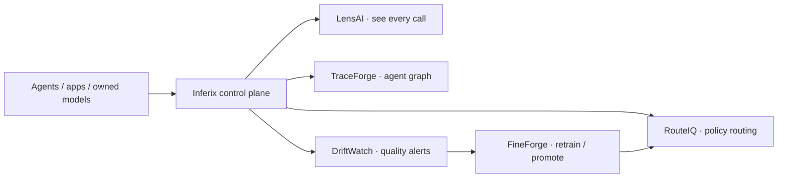

<div align="center">


# Akshant Sharma

### Software Engineer building distributed systems, high-cardinality data planes, and open-source AI infrastructure.

Nearly 9 years across Wayfair, Agoda, Delivery Hero, Walmart Labs, and Integration Wizards.

[](#)
[](#)
[](#)
[](#)
[](#)
[](#)
[](https://github.com/AkshantVats)

I work on the infrastructure layer underneath product features: ingestion engines, storage primitives, streaming pipelines, observability systems, and reliability controls that survive real traffic.

Currently building **[Inferix](https://github.com/AkshantVats/inferix)** — the control plane for agents and owned models: see every call, route by policy, catch quality drift, and retrain without guessing.

[LinkedIn](https://linkedin.com/in/akshantsharma07) · [Blog](https://akshantvats.github.io/Profile/blog/) · [Profile Site](https://akshantvats.github.io/Profile/) · [Email](mailto:akshant3@gmail.com)

<br/>

[`inferix`](#what-i-am-building-now) · [`flagship oss`](#flagship-oss) · [`live pulse`](#live-pulse) · [`experience`](#experience) · [`scale`](#production-scale-i-have-worked-on) · [`stack`](#stack) · [`contact`](mailto:akshant3@gmail.com)

</div>

---

## What I Am Building Now

### Inferix — the control plane for platform teams

Put agents and models behind one plane. See every call, route by policy, and catch quality drift. When quality drops, retrain and roll forward — without a second stack.



| Product | Job | Repo |
|---|---|---|
| **LensAI** | See every call — latency, cost, tokens, errors | [lensai-integration](https://github.com/AkshantVats/lensai-integration) · [infra-ai-streaming](https://github.com/AkshantVats/infra-ai-streaming) · [ebpf-llm-tracer](https://github.com/AkshantVats/ebpf-llm-tracer) |
| **TraceForge** | Trace tools + model hops end to end | [agent-trace-collector](https://github.com/AkshantVats/agent-trace-collector) |
| **RouteIQ** | Route easy work to owned SLMs, hard work to strong paths | [routeiq](https://github.com/AkshantVats/routeiq) |
| **DriftWatch** | Alert when quality slips vs teacher / golden set | [driftwatch](https://github.com/AkshantVats/driftwatch) |
| **FineForge** | Retrain, promote, roll back | [fineforge](https://github.com/AkshantVats/fineforge) |

Suite map + how to start: **[github.com/AkshantVats/inferix](https://github.com/AkshantVats/inferix)** · Marketing site: **[inferix-web](https://github.com/AkshantVats/inferix-web)**

```bash
# Observe stack today (LensAI quickstart)
git clone https://github.com/AkshantVats/lensai-integration.git
cd lensai-integration && make up
```

---

## Flagship OSS

### [inferix](https://github.com/AkshantVats/inferix) — suite entrypoint

The umbrella repo for the five-product control plane. Start here to see how LensAI, TraceForge, RouteIQ, DriftWatch, and FineForge connect — then jump into the product repos.

| Product | Status | Repository |
|---|---|---|
| **LensAI** | Active | [lensai-integration](https://github.com/AkshantVats/lensai-integration) · [infra-ai-streaming](https://github.com/AkshantVats/infra-ai-streaming) · [ebpf-llm-tracer](https://github.com/AkshantVats/ebpf-llm-tracer) |
| **TraceForge** | Active | [agent-trace-collector](https://github.com/AkshantVats/agent-trace-collector) |
| **RouteIQ** | Scaffold → building | [routeiq](https://github.com/AkshantVats/routeiq) |
| **DriftWatch** | Scaffold → building | [driftwatch](https://github.com/AkshantVats/driftwatch) |
| **FineForge** | Scaffold → building | [fineforge](https://github.com/AkshantVats/fineforge) |

**Deepest production-shaped code today:** [infra-ai-streaming](https://github.com/AkshantVats/infra-ai-streaming) — Rust ingest → Kafka/Redpanda → Go consumer → ClickHouse → Grafana (WAL, backpressure, DLQ, chaos, Helm/k3d).

<div align="center">

[](https://github.com/AkshantVats/inferix)
[](https://github.com/AkshantVats/infra-ai-streaming)
[](https://github.com/AkshantVats/agent-trace-collector)
[](https://github.com/AkshantVats/ebpf-llm-tracer)

</div>

---

## Live Pulse

### Repo progress

<!-- LIVE_REPO_PULSE:START -->
| Repo | Stars | Forks | Open issues | Last push | Latest commit |
|---|---:|---:|---:|---:|---|
| [inferix](https://github.com/AkshantVats/inferix) | 0 | 0 | 0 | 3d ago | [`94c958a`](https://github.com/AkshantVats/inferix/commit/94c958a) Document Inferix suite map and product repos. |
| [infra-ai-streaming](https://github.com/AkshantVats/infra-ai-streaming) | 0 | 0 | 5 | 1h ago | [`68d83f3`](https://github.com/AkshantVats/infra-ai-streaming/commit/68d83f345b7a1bf5816d25610e9320728f31bd50) semantic-cache-engine: cache analytics — hit rate, false-positive proxy, cost saved (Day 63) (#118) |
| [agent-trace-collector](https://github.com/AkshantVats/agent-trace-collector) | 0 | 0 | 0 | 6d ago | [`736dc1b`](https://github.com/AkshantVats/agent-trace-collector/commit/736dc1b) test: add GitHub Actions CI workflow and Makefile test targets (#2) |
| [routeiq](https://github.com/AkshantVats/routeiq) | 0 | 0 | 0 | 3d ago | [`e2041de`](https://github.com/AkshantVats/routeiq/commit/e2041de) Clarify RouteIQ scaffold and Inferix suite links. |
| [driftwatch](https://github.com/AkshantVats/driftwatch) | 0 | 0 | 0 | 3d ago | [`f75240e`](https://github.com/AkshantVats/driftwatch/commit/f75240e) Clarify DriftWatch scaffold and Inferix suite links. |
| [fineforge](https://github.com/AkshantVats/fineforge) | 0 | 0 | 0 | 3d ago | [`f2603e8`](https://github.com/AkshantVats/fineforge/commit/f2603e8) Clarify FineForge scaffold and Inferix suite links. |
| [ebpf-llm-tracer](https://github.com/AkshantVats/ebpf-llm-tracer) | 0 | 0 | 0 | 6d ago | [`4d3ce13`](https://github.com/AkshantVats/ebpf-llm-tracer/commit/4d3ce137097ecc9115a5b45ce01062716af02d5d) test: coverage improvements and GitHub Actions CI (#10) |
| [inferix-web](https://github.com/AkshantVats/inferix-web) | 0 | 0 | 0 | 1d ago | [`5157aec`](https://github.com/AkshantVats/inferix-web/commit/5157aec) Update Why Inferix headline to AI Control Plane positioning. |
| [Profile](https://github.com/AkshantVats/Profile) | 1 | 0 | 1 | 1h ago | [`0499dc6`](https://github.com/AkshantVats/Profile/commit/0499dc688d2ae901c2d3ba4b3395417524c395d3) sitemap+llms: Day 63 indexed |
<!-- LIVE_REPO_PULSE:END -->

### Latest writing

<!-- LATEST_BLOG_POSTS:START -->
- [Day 63 — Cache Quality Metrics](https://akshantvats.github.io/Profile/blog/series/ai-learning/day-63-cache-quality-metrics.html)
- [Day 63 — Hit Rate Without Honesty Is Vanity](https://akshantvats.github.io/Profile/blog/series/experience/day-63-hit-rate-without-honesty-is-vanity.html)
- [Day 62 — ANN Search at QPS](https://akshantvats.github.io/Profile/blog/series/ai-learning/day-62-ann-search-at-qps.html)
- [Day 62 — False Positives Have a Dollar Cost](https://akshantvats.github.io/Profile/blog/series/experience/day-62-false-positives-dollar-cost.html)
- [Day 61 — Embedding Pipelines](https://akshantvats.github.io/Profile/blog/series/ai-learning/day-61-embedding-pipelines.html)
<!-- LATEST_BLOG_POSTS:END -->

### Recent public activity

<!-- RECENT_ACTIVITY:START -->
- `1h ago` pushed to [AkshantVats/akshant-150-day-plan](https://github.com/AkshantVats/akshant-150-day-plan): pushed commits
- `1h ago` pushed to [AkshantVats/Profile](https://github.com/AkshantVats/Profile): pushed commits
- `1h ago` pushed to [AkshantVats/infra-ai-streaming](https://github.com/AkshantVats/infra-ai-streaming): pushed commits
- `1h ago` opened PR on [AkshantVats/infra-ai-streaming](https://github.com/AkshantVats/infra-ai-streaming)
- `1d ago` pushed to [AkshantVats/inferix-web](https://github.com/AkshantVats/inferix-web): AI Control Plane positioning
- `3d ago` pushed to [AkshantVats/inferix](https://github.com/AkshantVats/inferix): suite map
<!-- RECENT_ACTIVITY:END -->

---

## Experience

| Company | Role | Tenure |
|---|---|---|
| **Wayfair** · Bengaluru | Sr. Software Engineer III · PAS & Pricing Promotions | Nov 2024 – Mar 2026 |
| **Agoda** · Bangkok | Sr. Software Engineer · Core Infrastructure · WhiteFalcon TSDB | Apr 2024 – Sep 2024 |
| **Delivery Hero** · Berlin | Sr. Software Engineer · Global Logistics Platform | Jun 2021 – Mar 2024 |
| **Walmart Labs** · Bengaluru | Software Engineer II · WeIoT SmartBuildings | Aug 2018 – May 2021 |
| **Integration Wizards** · Bengaluru | IoT Lead · Industrial IoT Platform | Mar 2017 – Aug 2018 |

**Highlights**

- **Wayfair** — GCP global pricing & promotion engine; hours → sub-seconds across 20k+ suppliers; 250k+ SKU updates/supplier at 99.99% availability.
- **Agoda** — WhiteFalcon TSDB at 1.5T events/day; cross-tier quantile queries; RoaringBitmap Kubernetes dimensions; Parquet Zstd cold tier.
- **Delivery Hero** — 1M+ daily orders on EKS; 5k+ route updates/sec via OSRM; async SQS + Kinesis status path.
- **Walmart Labs** — 7M+ sensors on Azure IoT Hub; HVAC Stream Analytics loops; edge-to-cloud OTA.
- **Integration Wizards** — IIoT ingestion for Dover USA; edge preprocessing in low-bandwidth environments.

---

## Production Scale I Have Worked On

| Scale | System | Stack |
|---:|---|---|
| 1.5T events/day | WhiteFalcon TSDB at Agoda | Rust, Scala, Kafka, Ceph, Redis, S3 |
| 7M+ sensors | Walmart SmartBuildings IoT platform | Azure IoT Hub, Stream Analytics, edge-to-cloud OTA |
| 5k geo-events/sec | Delivery Hero rider tracking | OSRM, AWS EKS, Kinesis, async pipelines |
| 250k+ SKU updates/supplier | Wayfair global pricing engine | GCP, Kafka, BigQuery, Redis, circuit breakers |
| 1M+ daily orders | Delivery Hero logistics platform | Kubernetes, SQS, Kinesis, distributed tracing |

I like the hard parts: cardinality, backpressure, quantiles, hot partitions, durability boundaries, failure isolation, cost-aware scaling, and the line where "just use a managed service" stops working.

---

## Engineering Taste

- Design docs before abstractions.
- Benchmarks with hardware context.
- Failure modes written down before production finds them.
- Backpressure over blind autoscaling.
- Per-tenant metrics over global averages.
- Runbooks, dashboards, and chaos tests as part of the product.

---

## Stack

<div align="center">

[](#)

</div>

```text
Languages       Rust, Go, Java, Scala, Python
Streaming       Kafka, Redpanda, AWS Kinesis, Azure Event Hub
Storage         ClickHouse, Ceph, Redis, BigQuery, PostgreSQL, MongoDB, Parquet/S3
Infra           Kubernetes, Terraform, Helm, Docker, k3d
Cloud           AWS, GCP, Azure
Observability   OpenTelemetry, Prometheus, Grafana, ELK, distributed tracing
AI Infra        LLM inference pipelines, eBPF telemetry, evals, routing, cost controls
```

---

<div align="center">

### I am looking for Staff / Principal-level infrastructure roles where scale, reliability, and AI systems meet.

If your team cares about ingestion paths, storage engines, streaming systems, inference telemetry, or the reliability layer under AI products, we should talk.

[akshant3@gmail.com](mailto:akshant3@gmail.com) · [linkedin.com/in/akshantsharma07](https://linkedin.com/in/akshantsharma07) · [Inferix suite](https://github.com/AkshantVats/inferix)

<br/>


</div>
